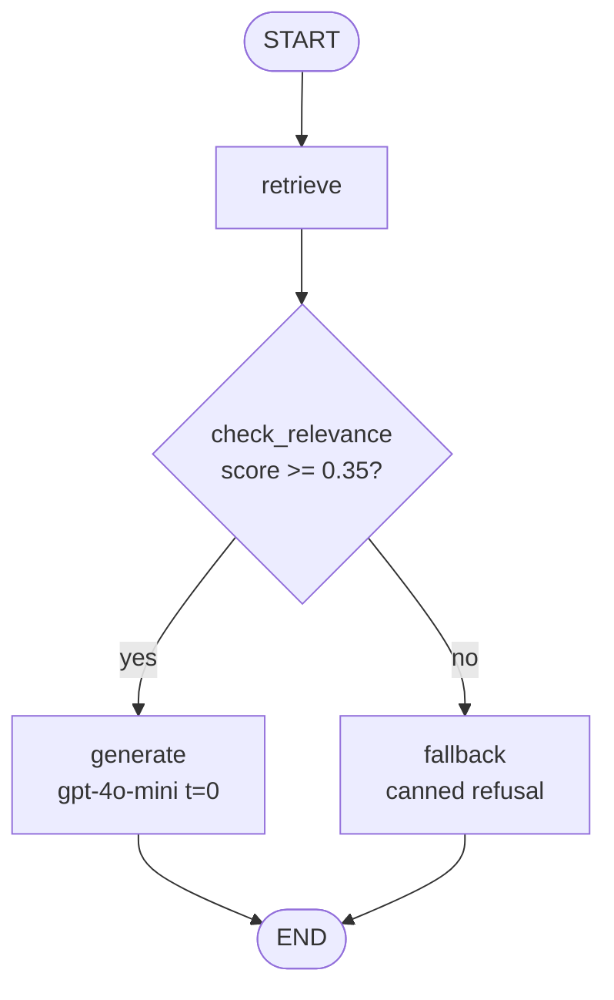

# Agentic AI RAG Chatbot

A RAG pipeline that answers questions **strictly from the Agentic AI eBook** (Konverge AI, 2024). Built with LangGraph, Pinecone, OpenAI embeddings, and FastAPI.

---

## Architecture



The pipeline has two phases:

- **Ingestion** (run once): PDF → page-aware loader → recursive chunker → OpenAI `text-embedding-3-small` → Pinecone upsert.
- **Query** (per request): embed question → Pinecone cosine search → relevance gate → LLM generation or canned fallback.

Full details in [`docs/architecture.md`](docs/architecture.md).

---

## Setup

### 1. Install dependencies

```bash
python -m venv .venv
source .venv/bin/activate
pip install -e ".[dev]"
```

### 2. Configure environment

```bash
cp .env.example .env
# Fill in OPENAI_API_KEY and PINECONE_API_KEY
```

Required variables:

| Variable | Description |
|---|---|
| `OPENAI_API_KEY` | OpenAI API key |
| `PINECONE_API_KEY` | Pinecone API key |
| `PINECONE_INDEX_NAME` | Index name (default: `agentic-ai-rag`) |

### 3. Place the PDF

```bash
# Download or copy the eBook
curl -L https://konverge.ai/pdf/Ebook-Agentic-AI.pdf -o data/Ebook-Agentic-AI.pdf
```

### 4. Ingest

```bash
python scripts/ingest.py data/Ebook-Agentic-AI.pdf
```

Ingestion is **idempotent** — re-running uses deterministic chunk IDs (SHA-256 of `filename:page:index`) so Pinecone upserts update in place rather than duplicating.

### 5. Run the server

```bash
uvicorn src.rag.api:app --reload
# API docs at http://127.0.0.1:8000/docs
```

---

## Example request

```bash
curl -X POST http://127.0.0.1:8000/chat \
     -H "Content-Type: application/json" \
     -d '{"question": "What is agentic AI?"}'
```

```json
{
  "answer": "Agentic AI refers to AI systems capable of autonomous goal-directed action, planning, and tool use without constant human direction (p. 4).",
  "confidence": 0.712,
  "sources": [
    {"text": "Agentic AI systems ...", "page": 4, "score": 0.81},
    {"text": "Unlike traditional AI ...", "page": 5, "score": 0.74}
  ]
}
```

---

## Sample queries

Run all 6 at once (server must be running):

```bash
python scripts/run_samples.py
```

| Question | Expected behaviour |
|---|---|
| What is agentic AI and how does it differ from traditional AI? | In-scope; cites pages 4–6 |
| What are the core components of an agentic AI system? | In-scope; multi-chunk answer |
| How do multi-agent systems coordinate tasks? | In-scope; cites coordination mechanisms |
| What role does memory play in agentic AI pipelines? | In-scope; short- and long-term memory |
| What are the main risks or limitations of agentic AI? | In-scope; safety, alignment |
| Who won the FIFA World Cup in 2022? | **Out-of-scope** → fallback refusal |

The out-of-scope question demonstrates the relevance gate: the top cosine score falls below 0.35, so the LLM is never called and the response is the canned refusal message.

---

## Running tests

```bash
pytest tests/ -v
```

Three test classes:
- `TestChunker` — chunk structure, deterministic IDs, uniqueness
- `TestRelevanceRouting` — threshold logic, edge cases
- `TestChatEndpoint` — API schema, HTTP codes (LLM mocked)

---

## Design decisions and known limitations

### Chunk size: 900 characters / 120 overlap

900 characters is roughly 180–200 tokens, well within the 8192-token embedding window of `text-embedding-3-small`. Smaller chunks (400–500 chars) risk cutting sentences mid-thought; larger chunks (1500+ chars) dilute the embedding signal by mixing topics. 120-character overlap preserves context across boundaries.

### Threshold: 0.35 cosine similarity

Chosen empirically by running the 6 sample queries and inspecting score distributions. In-scope questions scored 0.45–0.85; the out-of-scope World Cup question scored 0.12–0.18. 0.35 sits between those bands. This is **not calibrated** on a proper held-out set — with more queries the threshold should be tuned using precision/recall curves.

### Confidence score

`confidence = mean(top-k cosine scores)`. This is a retrieval-side heuristic that captures how semantically similar the retrieved chunks are to the question. It does **not** measure factual correctness of the answer, and it is not derived from the LLM. A score near 1.0 means the query closely matched the document; near 0 means poor retrieval.

### Known limitations

- **Tables and figures extract poorly.** PyMuPDF returns table content as unstructured text. A dedicated table parser (e.g. `pdfplumber`) would improve coverage.
- **Fixed threshold is not calibrated.** 0.35 was set on 6 queries. A larger query set and a proper split would produce a more reliable threshold.
- **No reranker.** A cross-encoder reranker (e.g. `ms-marco-MiniLM`) would improve the ranking of chunks before passing them to the LLM.
- **Single index, no namespacing.** If multiple documents are added later, namespacing by document ID in Pinecone would prevent cross-document leakage.
