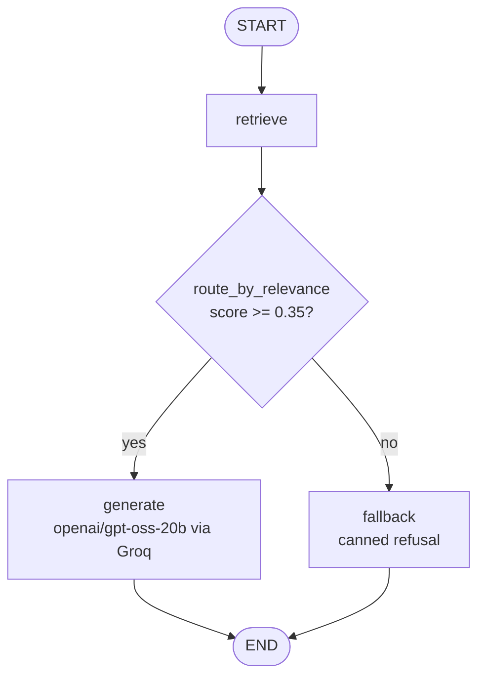

# Agentic AI RAG Chatbot

A RAG pipeline that answers questions **strictly from the Agentic AI eBook** (Konverge AI, 2024). Built with LangGraph, Pinecone, Gemini embeddings, Groq LLM, and FastAPI.

---

## Architecture



The pipeline has two phases:

- **Ingestion** (run once): PDF → page-aware loader → recursive chunker → `gemini-embedding-2` (3072-d) → Pinecone upsert.
- **Query** (per request): embed question → Pinecone cosine search → relevance gate → Groq LLM generation or canned fallback.

Full details in [`docs/architecture.md`](docs/architecture.md).

---

## Setup

### 1. Install dependencies

```bash
python -m venv .venv
source .venv/bin/activate
pip install -e ".[dev]"
```

### 2. Configure environment

```bash
cp .env.example .env
# Fill in all four keys
```

Required variables:

| Variable | Description |
|---|---|
| `GEMINI_API_KEY` | Google AI Studio key (for `gemini-embedding-2`) |
| `GROQ_API_KEY` | Groq API key (for `openai/gpt-oss-20b`) |
| `PINECONE_API_KEY` | Pinecone API key |
| `PINECONE_INDEX_NAME` | Index name (default: `agentic-ai-rag`) |

### 3. Place the PDF

```bash
# Download or copy the eBook into the data/ directory
curl -L https://konverge.ai/pdf/Ebook-Agentic-AI.pdf -o data/Ebook-Agentic-AI.pdf
```

### 4. Ingest

```bash
python -m src.rag.ingest data/Ebook-Agentic-AI.pdf
# or use the helper script:
python scripts/ingest.py data/Ebook-Agentic-AI.pdf
```

Ingestion is **idempotent** — chunk IDs are derived from SHA-256 of `filename:page:index`, so re-running upserts in-place rather than duplicating vectors.

> ⚠️ The `gemini-embedding-2` free tier allows 100 requests/min. The ingestor automatically pauses 65 s between batches of 100 chunks.

### 5. Run the server

```bash
uvicorn src.rag.api:app --reload
# API docs at http://127.0.0.1:8000/docs
```

---

## API

### `GET /health`

Returns `{"status": "ok"}`.

### `POST /chat`

**Request body:**

```json
{ "question": "What is agentic AI?" }
```

**Response:**

```json
{
  "answer": "Agentic AI is a type of system that can autonomously make decisions...",
  "confidence": 0.7815,
  "sources": [
    {"text": "Agentic AI systems ...", "page": 18, "score": 0.87},
    {"text": "Unlike traditional AI ...", "page": 11, "score": 0.74}
  ]
}
```

Field details:

| Field | Type | Description |
|---|---|---|
| `answer` | `string` | LLM answer with page citations, or canned refusal |
| `confidence` | `float [0,1]` | Mean cosine similarity of top-k retrieved chunks |
| `sources` | `list[Source]` | Retrieved chunks with `text`, `page`, and `score` |

---

## Example request

```bash
curl -X POST http://127.0.0.1:8000/chat \
     -H "Content-Type: application/json" \
     -d '{"question": "What is agentic AI?"}'
```

---

## Sample queries

Run all 6 at once (server must be running):

```bash
python scripts/run_samples.py
# Results saved to docs/sample_outputs.json
```

| Question | Expected behaviour |
|---|---|
| What is agentic AI and how does it differ from traditional AI? | In-scope; cites pages from eBook |
| What are the core components of an agentic AI system? | In-scope; multi-chunk answer |
| How do multi-agent systems coordinate tasks? | In-scope; cites coordination mechanisms |
| What role does memory play in agentic AI pipelines? | In-scope; short- and long-term memory |
| What are the main risks or limitations of agentic AI? | In-scope; safety, alignment |
| Who won the FIFA World Cup in 2022? | **Out-of-scope** → fallback refusal |

The out-of-scope question demonstrates the relevance gate: the top cosine score falls below 0.35, so the Groq LLM is never called and the response is the canned refusal message.

---

## Running tests

```bash
pytest tests/ -v
```

Three test classes:

- `TestChunker` — chunk structure, deterministic IDs, uniqueness
- `TestRelevanceRouting` — threshold logic, edge cases
- `TestChatEndpoint` — API schema, HTTP codes (LLM mocked)

---

## Project structure

```
.
├── data/                        # Place the eBook PDF here
├── docs/
│   ├── architecture.md          # Detailed architecture notes
│   └── sample_outputs.json      # Output from run_samples.py
├── scripts/
│   ├── ingest.py                # CLI wrapper for ingest pipeline
│   └── run_samples.py           # Batch sample query runner
├── src/rag/
│   ├── api.py                   # FastAPI app (GET /health, POST /chat)
│   ├── config.py                # Pydantic-settings config (reads .env)
│   ├── graph.py                 # LangGraph RAG pipeline (retrieve → route → generate/fallback)
│   ├── ingest.py                # PDF loader, chunker, embedder, Pinecone upsert
│   ├── prompts.py               # System prompt and user prompt template
│   ├── schemas.py               # Pydantic models: ChatRequest, ChatResponse, Source
│   └── vectorstore.py           # Pinecone client factory (auto-creates index if absent)
├── tests/
│   └── test_rag.py              # Pytest suite
├── pyproject.toml
├── .env.example
└── README.md
```

---

## Design decisions and known limitations

### Embedding model: `gemini-embedding-2` (3072-d)

Google's latest embedding model outputs 3072-dimensional vectors. Pinecone index is created with `metric="cosine"` on AWS `us-east-1`. The high dimensionality improves retrieval quality at the cost of storage and slightly slower query times.

### LLM: Groq (`openai/gpt-oss-20b`)

Groq's inference hardware provides very low latency. The model is instructed via a strict system prompt to answer only from the provided context passages and cite page numbers.

### Chunk size: 900 characters / 120 overlap

900 characters is roughly 180–200 tokens, well within the embedding model's context window. Smaller chunks risk cutting sentences mid-thought; larger chunks dilute the embedding signal by mixing topics. 120-character overlap preserves context across boundaries.

### Threshold: 0.35 cosine similarity

Chosen empirically by running the 6 sample queries and inspecting score distributions. In-scope questions scored 0.45–0.85; the out-of-scope World Cup question scored 0.12–0.18. 0.35 sits between those bands. This is **not calibrated** on a proper held-out set.

### Confidence score

`confidence = mean(top-k cosine scores)`. This is a retrieval-side heuristic — it captures how semantically similar the retrieved chunks are to the question. It does **not** measure factual correctness, and it is not derived from the LLM.

### Known limitations

- **Tables and figures extract poorly.** PyMuPDF returns table content as unstructured text. A dedicated table parser (e.g. `pdfplumber`) would improve coverage.
- **Fixed threshold is not calibrated.** 0.35 was set on 6 queries. A larger query set and a proper train/test split would produce a more reliable threshold.
- **No reranker.** A cross-encoder reranker (e.g. `ms-marco-MiniLM`) would improve chunk ranking before passing to the LLM.
- **Single index, no namespacing.** If multiple documents are added, namespacing by document ID in Pinecone would prevent cross-document leakage.
- **Rate-limit on free Gemini tier.** The embedder sleeps 65 s between batches of 100 chunks during ingestion.
