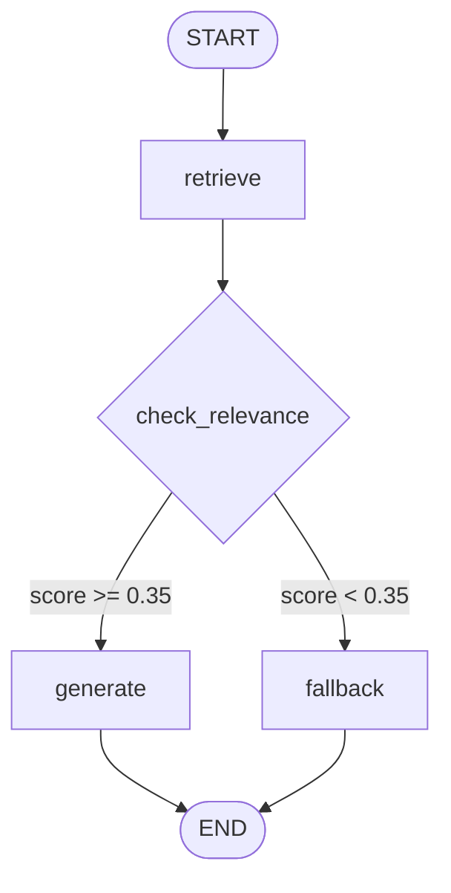

# Architecture

## Overview

The system has two runtime phases: an offline **ingestion** phase and an online **query** phase.

```
Ingestion (run once):
PDF → page-aware loader → recursive chunker → OpenAI embeddings → Pinecone upsert

Query (per request):
HTTP POST /chat
  └─ FastAPI
       └─ LangGraph
            ├─ retrieve   : embed question → Pinecone query → top-k chunks
            ├─ check_relevance (conditional edge)
            │     ├─ score ≥ 0.35 → generate : LLM (gpt-4o-mini, t=0) → answer + citations
            │     └─ score < 0.35 → fallback  : canned "not found" response
            └─ return {answer, confidence, sources}
```

## LangGraph flow



## State

```python
class RAGState(TypedDict):
    question:   str
    chunks:     list[dict]   # {text, page, score}
    scores:     list[float]
    answer:     str
    confidence: float
```

## Confidence score formula

```
confidence = mean(cosine_scores[:top_k])
```

All values are already in [0, 1] because Pinecone returns normalised cosine similarity.
This is a retrieval-side heuristic — it measures how well the retrieved passages
match the query, not whether the LLM answer is correct.

## Key design choices

| Decision | Choice | Reason |
|---|---|---|
| PDF loader | PyMuPDF (`fitz`) | Fast, page-level extraction, returns clean text |
| Chunker | `RecursiveCharacterTextSplitter` | Respects paragraph/sentence boundaries, configurable separators |
| Chunk size | 900 chars / 120 overlap | ~180-200 tokens; fits in embedding window, preserves sentence context across boundaries |
| Embedding | `text-embedding-3-small` (1536-d) | Good quality/cost trade-off; deterministic output for same input |
| Chunk IDs | SHA-256 of `filename:page:index` | Upserts are idempotent — re-running ingestion won't duplicate vectors |
| LLM | `gpt-4o-mini`, temperature 0 | Minimal cost, deterministic outputs, follows system prompt reliably |
| Threshold | 0.35 cosine | Empirically chosen on 6 test queries; see README limitations |
