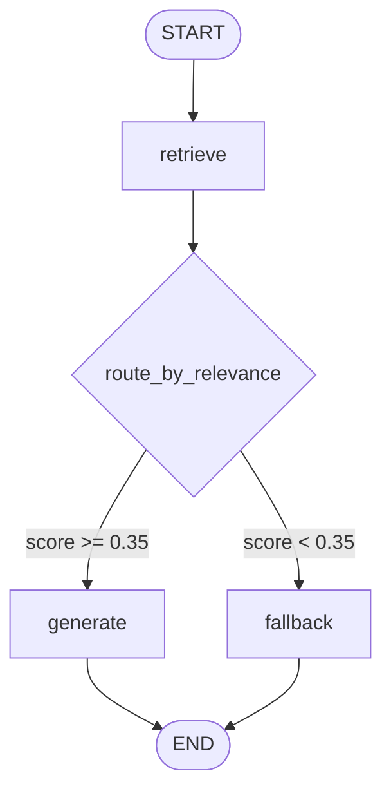

# Architecture

## Overview

The system has two runtime phases: an offline **ingestion** phase and an online **query** phase.

```
Ingestion (run once):
PDF → page-aware loader (PyMuPDF) → recursive chunker → gemini-embedding-2 (3072-d) → Pinecone upsert

Query (per request):
HTTP POST /chat
  └─ FastAPI
       └─ LangGraph
            ├─ retrieve          : embed question → Pinecone cosine query → top-5 chunks
            ├─ route_by_relevance (conditional edge)
            │     ├─ max score ≥ 0.35 → generate : Groq LLM → answer + page citations
            │     └─ max score < 0.35 → fallback  : canned "not found" response
            └─ return {answer, confidence, sources}
```

---

## LangGraph flow



### Nodes

| Node | Description |
|---|---|
| `retrieve` | Embeds the question with `gemini-embedding-2`, queries Pinecone for the top-5 chunks by cosine similarity |
| `generate` | Formats retrieved chunks as numbered context passages and calls the Groq LLM with a strict system prompt |
| `fallback` | Returns the canned "not found" message without calling the LLM |

### Conditional edge: `route_by_relevance`

```python
def route_by_relevance(state: RAGState) -> Literal["generate", "fallback"]:
    top = max((c["score"] for c in state["chunks"]), default=0.0)
    return "generate" if top >= settings.relevance_threshold else "fallback"
```

The gate inspects the **maximum** cosine score among retrieved chunks. If it is below `relevance_threshold` (default 0.35), the LLM is never called.

---

## State

```python
class RAGState(TypedDict):
    question:   str
    chunks:     list[dict]   # each: {text: str, page: int, score: float}
    answer:     str
    confidence: float
```

---

## Confidence score formula

```
confidence = mean(cosine_scores for all top-k chunks)
```

Implemented as:

```python
def _confidence(chunks: list[dict]) -> float:
    return round(statistics.mean(c["score"] for c in chunks), 4) if chunks else 0.0
```

All scores are already in [0, 1] because Pinecone returns normalised cosine similarity.
This is a **retrieval-side heuristic** — it measures how well the retrieved passages
match the query, not whether the LLM answer is correct.

---

## Ingestion pipeline

```
scripts/ingest.py  or  python -m src.rag.ingest <pdf>
       │
       ▼
src/rag/ingest.py::ingest(pdf_path)
  ├── load_pages()        # PyMuPDF: extracts (page_num, text) per page, skips blank pages
  ├── chunk_pages()       # RecursiveCharacterTextSplitter: 900 chars / 120 overlap
  │                       # Chunk ID = SHA-256(filename:page:index)[:16]  → idempotent upserts
  ├── embed()             # GoogleGenerativeAIEmbeddings (gemini-embedding-2, 3072-d)
  │                       # Batched 100 chunks at a time; 65 s pause between batches (rate limit)
  └── index.upsert()      # Pinecone upsert with metadata: {text, page}
```

---

## API layer

| Endpoint | Method | Description |
|---|---|---|
| `/health` | GET | Liveness check — returns `{"status": "ok"}` |
| `/chat` | POST | Accepts `{"question": str}`, returns `ChatResponse` |

### Request / Response schemas (Pydantic)

```python
class ChatRequest(BaseModel):
    question: str = Field(..., min_length=1, max_length=500)

class Source(BaseModel):
    text:  str
    page:  int
    score: float

class ChatResponse(BaseModel):
    answer:     str
    confidence: float = Field(..., ge=0.0, le=1.0)
    sources:    list[Source]
```

---

## Key design choices

| Decision | Choice | Reason |
|---|---|---|
| PDF loader | PyMuPDF (`fitz`) | Fast, page-level extraction, returns clean text |
| Chunker | `RecursiveCharacterTextSplitter` | Respects paragraph/sentence boundaries; configurable separators |
| Chunk size | 900 chars / 120 overlap | ~180–200 tokens; fits embedding window, preserves sentence context across boundaries |
| Embedding | `gemini-embedding-2` (3072-d) | High-dimensional, high-quality embeddings from Google AI Studio |
| Chunk IDs | SHA-256 of `filename:page:index` | Upserts are idempotent — re-running ingestion won't duplicate vectors |
| Vector store | Pinecone serverless (cosine, AWS us-east-1) | Managed, scalable, no infrastructure to maintain |
| LLM | Groq (`openai/gpt-oss-20b`) | Very low latency via Groq inference hardware |
| Relevance gate | max cosine ≥ 0.35 | Prevents hallucination on out-of-scope queries; threshold empirically set on 6 sample queries |
| Confidence | mean of top-k cosine scores | Simple retrieval-quality heuristic; exposed in API response |

---

## Configuration (via `.env`)

All parameters are managed by Pydantic-settings in `src/rag/config.py`:

| Setting | Default | Description |
|---|---|---|
| `GEMINI_API_KEY` | — | Google AI Studio key |
| `GROQ_API_KEY` | — | Groq API key |
| `PINECONE_API_KEY` | — | Pinecone API key |
| `PINECONE_INDEX_NAME` | `agentic-ai-rag` | Pinecone index name |
| `CHUNK_SIZE` | `900` | Characters per chunk |
| `CHUNK_OVERLAP` | `120` | Overlap between chunks |
| `TOP_K` | `5` | Number of chunks retrieved per query |
| `RELEVANCE_THRESHOLD` | `0.35` | Minimum cosine score to trigger LLM |
| `EMBEDDING_MODEL` | `gemini-embedding-2` | Embedding model name |
| `EMBEDDING_DIM` | `3072` | Vector dimensionality |
| `LLM_MODEL` | `openai/gpt-oss-20b` | Groq model identifier |
